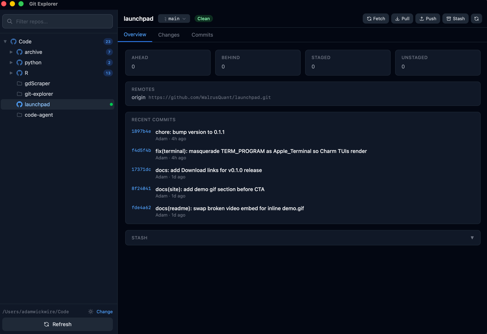
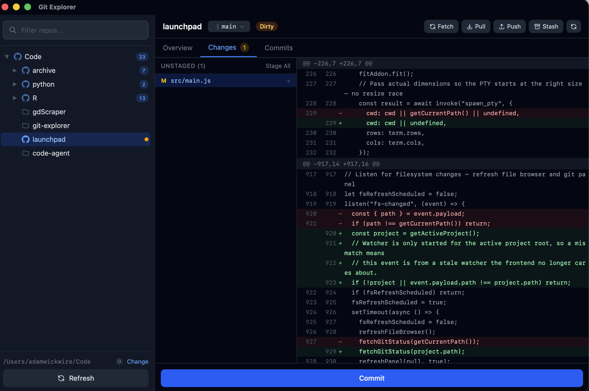

# Git Explorer

A macOS desktop app that shows git repos as a navigable folder tree. Built with Tauri v2, Svelte 5, and the git2 Rust crate.


*Overview: repo status, remotes, and recent commits.*


*Changes: staged/unstaged files with an inline diff view.*

## Install

> **No releases yet.** The first release will appear on the [Releases page](https://github.com/WalrusQuant/git-explorer/releases) as `git-explorer-macos-aarch64.dmg` (Apple Silicon). Intel Macs are not supported in the binary release — build from source if needed.

After downloading:

1. Open the `.dmg` and drag **Git Explorer** to `/Applications`.
2. The app is **unsigned**, so the first launch will be blocked by Gatekeeper. **Right-click the app → Open** to bypass it once.
3. On first launch you'll be asked to pick a root directory — point it at the folder containing your projects.

## Status indicators

| Color  | Meaning                        |
|--------|--------------------------------|
| Green  | Clean — no changes, up to date |
| Yellow | Dirty — uncommitted changes    |
| Blue   | Ahead of remote                |
| Red    | Behind remote                  |
| Orange | Diverged (both ahead & behind) |

## Configuration

Settings are stored at:

```
~/.config/git-explorer/config.json
```

Currently a single field:

```json
{
  "root_path": "/Users/you/Code"
}
```

## Building from source

Prereqs:

- macOS
- Rust — install via [rustup](https://rustup.rs/)
- pnpm — `npm install -g pnpm`
- Xcode Command Line Tools — `xcode-select --install`

Run the dev server:

```bash
pnpm install
pnpm tauri dev
```

Produce a `.app` bundle:

```bash
pnpm tauri build
```

Type check + tests:

```bash
pnpm check
cd src-tauri && cargo test
```

## Architecture

- **Rust backend** (`src-tauri/src/commands/`) — split per domain: `status`, `scan`, `staging`, `branches`, `commits`, `remote`, `stash`, `config`, `helpers`, `types`. Most operations use `git2`; network ops (`fetch`, `push`, `pull`, `merge`) shell out to the `git` CLI for credential/SSH-agent support and are cancellable.
- **Svelte 5 frontend** (`src/`) — runes only (`$state`, `$derived`, `$effect`, `$props`), no stores. Top-level state lives in `App.svelte` and is passed down as props.

For deeper architecture notes, see [CLAUDE.md](CLAUDE.md).

## Changelog

See [CHANGELOG.md](CHANGELOG.md).

## License

Apache License 2.0 — see [LICENSE](LICENSE).
